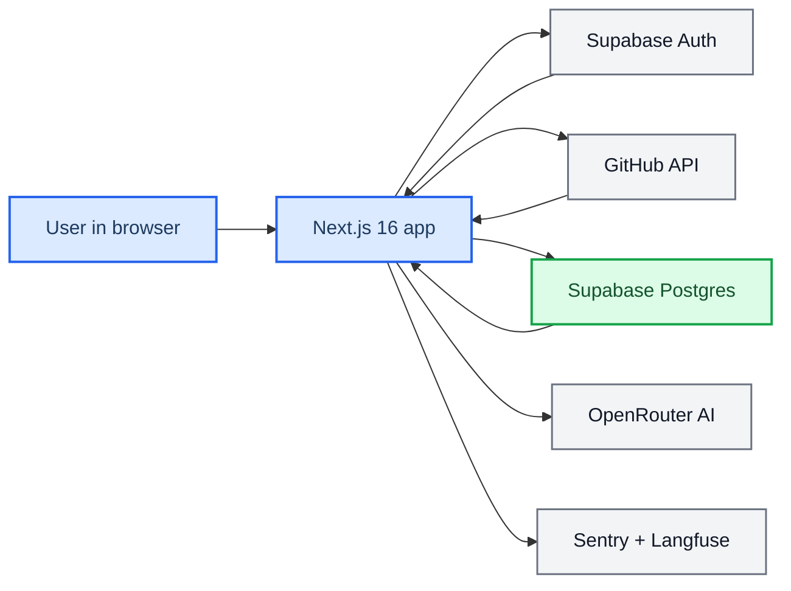

# StarDash

_Private repository for a Next.js dashboard that turns GitHub stars into a searchable, organized, AI-assisted workspace._

---

## 📋 Overview

StarDash is a personal dashboard for developers who use GitHub stars as a discovery and bookmarking system, then need a better way to work with that backlog.

After signing in with GitHub through Supabase OAuth, a user can:

- Sync their starred repositories from GitHub
- Search, filter, sort, and page through large star collections
- Add notes, status labels, tags, collections, and pinned repos
- Read repository READMEs without leaving the app
- Unstar repositories from inside the dashboard
- Generate AI-assisted tags and collections for uncategorized repos
- Browse a separate trending view based on recent starring behavior
- See lightweight repo health signals such as trend status and major releases

The app is built with Next.js App Router, Supabase Auth + Postgres, shadcn/ui, Tailwind CSS v4, Sentry, and Langfuse.

## 🧭 What is implemented

### Product behavior

- GitHub OAuth login via Supabase
- Protected dashboard, trending, and settings routes
- Full starred-repo sync from GitHub with pagination support
- Client-side local cache of repo data for faster reloads and degraded-mode fallback
- Per-user metadata persistence in Supabase for:
  - status
  - notes
  - pinned state
  - tags
  - collections
- AI categorization via OpenRouter using a two-phase taxonomy + batch classification flow
- Daily star snapshot cron job for trend calculations
- Observability wiring for Sentry and Langfuse

### Current storage model

The app does not treat Supabase as the primary source of starred repositories for rendering the dashboard.

- GitHub is still the source of truth for the live starred-repo list
- The browser keeps a 24-hour local cache keyed by user ID
- Supabase stores synchronized repo records plus user-specific metadata and historical snapshots
- The UI overlays database metadata on top of the live GitHub repo payload

That means the app already persists useful repo and user metadata, but the dashboard still refreshes from GitHub rather than reading the repo list directly from Postgres.

## 🏗️ Architecture



### Main request flow

1. The user signs in with GitHub through Supabase OAuth.
2. Supabase returns a session that includes the GitHub `provider_token`.
3. The callback route stores the token and token expiry metadata on the `profiles` row.
4. The dashboard calls `GET /api/github/starred`.
5. The server fetches the user’s full starred list from GitHub.
6. Synced repos are upserted into Supabase.
7. The client fetches user metadata from Supabase and overlays it on the GitHub response.
8. Optional AI categorization writes generated tags and collections back to Supabase.

## ✨ Core features

### Dashboard

The main dashboard is the operational center of the app.

- Grid and list layouts
- Search across repo name, owner, description, notes, and tags
- Sort by starred date, GitHub stars, update recency, or name
- Filter by language, tag, collection, or uncategorized state
- Pagination with adjustable page size
- Repo detail drawer
- README viewer
- Command palette with quick actions and repo jump
- Inline refresh behavior with cache-aware fallback

### User metadata

Each starred repository can accumulate user-owned metadata:

- `status`: `want-to-try`, `currently-using`, `tried-liked`, `tried-dropped`, `just-interesting`, `reference`
- freeform notes
- pinned state
- many-to-many tags
- many-to-many collections

Tags and collections are managed from the settings screen and persisted in Supabase.

### AI categorization

The AI flow is implemented in `app/api/ai/categorize/route.ts` and `lib/ai-categorize.ts`.

- Uses OpenRouter through the AI SDK
- Analyzes up to 500 repos
- Phase 1 generates:
  - 5 to 12 collections
  - 15 to 25 reusable tags
- Phase 2 classifies repos in batches of 100
- Generated tags and collections are persisted into the user’s Supabase data model
- Categorization is rate-limited to once every 24 hours per user
- Langfuse telemetry is enabled for the AI calls

### Trending view

The trending page is a derived recommendation experience based on the user’s most recent 25 stars.

It computes:

- top languages
- top topics
- three recommendation buckets:
  - Popular in Your Network
  - Heating Up
  - Hidden Gems

This is currently heuristic, not model-driven.

### Repo health signals

`GET /api/github/health` combines Supabase snapshot data with GitHub release data to expose:

- `isTrending`
  - currently defined as a repo having at least 10 stars and doubling within 30 days based on daily snapshots
- `latestRelease`
  - only returned when a non-prerelease major release happened after the user starred the repo

### Daily star snapshots

Vercel Cron calls `/api/cron/star-snapshots` on the schedule in `vercel.json`.

- schedule: `0 2 * * *`
- purpose: store daily star counts in `repo_star_snapshots`
- auth: optional `CRON_SECRET` bearer token

## 🗂️ Project structure

```text
app/
  (authenticated)/         Authenticated routes: dashboard, trending, settings
  api/                     Route handlers for GitHub, AI, user metadata, cron, observability
  auth/                    Login, OAuth callback, auth error pages
components/
  ui/                      shadcn/ui primitives
  *.tsx                    Dashboard, settings, trending, repo UI
lib/
  github.ts                GitHub API access
  ai-categorize.ts         AI taxonomy and classification flow
  user-metadata.ts         Supabase persistence helpers
  tokens.ts                GitHub token retrieval and expiry handling
  supabase/                Browser, server, admin, and middleware clients
scripts/
  *.sql                    Schema and policy migrations
```

## 🧱 Data model

The current schema evolved from an earlier `starred_repos` table into a split global/user model.

### Important tables

- `profiles`
  - one row per authenticated user
  - stores GitHub identity metadata
  - stores GitHub provider token and expiry metadata
  - stores `last_ai_categorization_at`
- `repos`
  - global repository catalog keyed by GitHub repo ID
- `user_starred_repos`
  - user-to-repo mapping plus user-owned repo state
- `tags`
  - user-owned labels
- `collections`
  - user-owned groups
- `user_starred_repo_tags`
  - junction table between starred repos and tags
- `user_starred_repo_collections`
  - junction table between starred repos and collections
- `repo_star_snapshots`
  - daily star count history for trend detection

### Important design detail

The codebase still contains older migration history for `starred_repos`, `repo_tags`, and `repo_collections`, but the active application logic uses the newer `repos` plus `user_starred_repos` model.

## 🔐 Authentication and security

Authentication is GitHub OAuth through Supabase.

- Server components and route handlers use `supabase.auth.getUser()` for validation
- Middleware refreshes the session on every request
- Authenticated users are redirected away from `/auth/login`
- Protected route groups live under `app/(authenticated)`
- Row Level Security is enabled across the main tables

Important implementation detail:

- GitHub API calls use the per-user OAuth `provider_token`
- there is no shared GitHub personal access token for normal user flows
- if the provider token is missing or expired, the app requires the user to sign in again

## 🔌 API surface

### GitHub and dashboard APIs

- `GET /api/github/starred`
  - syncs the full starred repo list from GitHub
  - upserts repo data into Supabase
- `GET /api/github/readme?owner=&repo=`
  - fetches and base64-decodes a repo README
- `DELETE /api/github/star`
  - removes a star on GitHub and deletes associated local metadata
- `GET /api/github/health?repoIds=...`
  - returns trend and release signals for repos

### User metadata APIs

- `GET /api/user/metadata`
  - returns tags, collections, and per-repo metadata for the current user

### AI and operations APIs

- `POST /api/ai/categorize`
  - categorizes repos with AI and persists results
- `GET /api/cron/star-snapshots`
  - cron-only route for daily star snapshots
- `GET /api/test-observability`
  - smoke test for Langfuse setup

## 🖥️ Tech stack

- Next.js 16 with App Router
- React 19
- TypeScript
- Tailwind CSS v4
- shadcn/ui
- Supabase Auth + Postgres
- SWR
- OpenRouter via `@openrouter/ai-sdk-provider`
- Vercel Analytics
- Sentry
- Langfuse

## ⚙️ Local development

### Prerequisites

- Node.js 20+ recommended
- `pnpm`
- Supabase project configured for GitHub OAuth
- GitHub OAuth provider configured inside Supabase

### Install and run

```bash
pnpm install
pnpm dev
```

The app runs at `http://localhost:3000`.

### Available scripts

```bash
pnpm dev
pnpm build
pnpm lint
pnpm start
```

## 🔑 Environment variables

### Required for core app behavior

```bash
NEXT_PUBLIC_SUPABASE_URL=
NEXT_PUBLIC_SUPABASE_ANON_KEY=
SUPABASE_SERVICE_ROLE_KEY=
OPENROUTER_API_KEY=
CRON_SECRET=
```

### Required for Sentry

```bash
NEXT_PUBLIC_SENTRY_DSN=
SENTRY_ORG=
SENTRY_PROJECT=
SENTRY_AUTH_TOKEN=
```

### Required for Langfuse

```bash
LANGFUSE_SECRET_KEY=
LANGFUSE_PUBLIC_KEY=
LANGFUSE_BASE_URL=
```

### Notes

- `LANGFUSE_BASE_URL` must be passed explicitly when creating Langfuse clients and processors in this app
- `SUPABASE_SERVICE_ROLE_KEY` is required for admin writes, repo upserts, and cron-driven snapshot storage
- `OPENROUTER_API_KEY` is required for AI categorization

## 🚀 Deployment

The app is intended for Vercel deployment.

- `vercel.json` defines a daily cron for repo star snapshots
- Sentry is wired through `withSentryConfig(...)` in `next.config.mjs`
- `next.config.mjs` currently sets `typescript.ignoreBuildErrors = true`

That last point matters: production builds can succeed even if TypeScript errors exist.

## 📈 Observability

### Sentry

Sentry is configured for client, server, and edge contexts.

- `sentry.client.config.ts`
- `sentry.server.config.ts`
- `sentry.edge.config.ts`
- `app/global-error.tsx`
- `instrumentation.ts`

### Langfuse

Langfuse captures AI telemetry from the categorization pipeline.

- AI SDK calls enable `experimental_telemetry`
- `instrumentation.ts` registers a `LangfuseSpanProcessor`
- long-running routes flush spans with `after(async () => langfuseSpanProcessor?.forceFlush())`

## 🧪 Quality checks

There is no formal test suite configured in this repository right now.

Use:

```bash
pnpm lint
```

Also note that `pnpm build` does not enforce TypeScript correctness because build-time TS errors are explicitly ignored in `next.config.mjs`.

## ⚠️ Known implementation notes

- The repo started from a v0 scaffold, but the application logic is now custom
- Some migration history reflects an older schema shape that is no longer the primary runtime model
- The dashboard fetches repo lists from GitHub on sync rather than serving them primarily from Supabase
- AI categorization is intentionally capped and rate-limited to control cost and abuse
- This is a private repository, so this README intentionally does not include open-source contribution guidance
