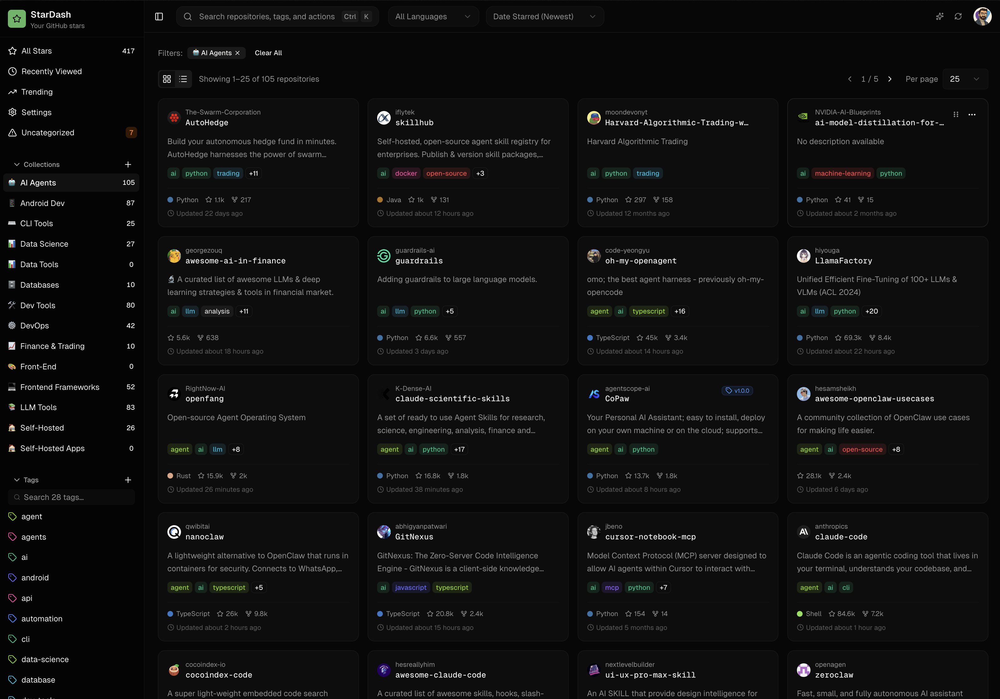
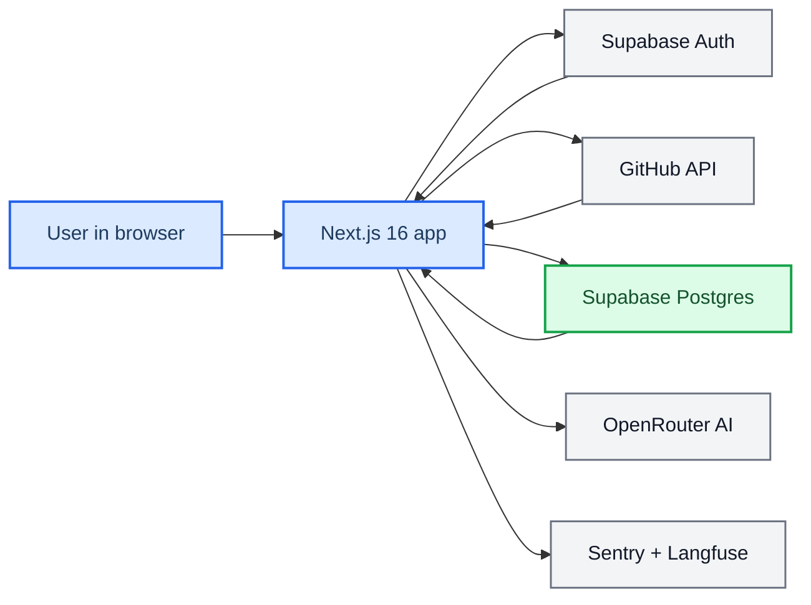

<div align="center">

<h1>StarDash</h1>

<p>Turn your GitHub stars into a searchable, organized, AI-powered contribution workspace.</p>

<picture>
  <source media="(prefers-color-scheme: dark)" srcset="stardash_dark.png">
  <source media="(prefers-color-scheme: light)" srcset="stardash_light.png">
  
</picture>

<br/>

**[→ Try it live at stardash.dev](https://stardash.dev)**

<br/>

[](./LICENSE)
[](https://nextjs.org/)
[](https://www.typescriptlang.org/)
[](https://tailwindcss.com/)
[](https://supabase.com/)
[](./Dockerfile)

[](./mcp/)
[](https://github.com/boffti/stardash/stargazers)
[](https://github.com/boffti/stardash/network/members)
[](https://github.com/boffti/stardash/issues)
[](./CONTRIBUTING.md)

[**stardash.dev**](https://stardash.dev) · [**Self-Host**](#-self-hosting) · [**Report a Bug**](https://github.com/boffti/stardash/issues/new?labels=bug) · [**Request a Feature**](https://github.com/boffti/stardash/issues/new?labels=enhancement)

</div>

---

## 📋 Overview

StarDash is an open-source personal dashboard for developers who use GitHub stars as a discovery and bookmarking system. It turns your stars into a searchable, organized, AI-assisted workspace — with deep repo intelligence, contribution discovery, and proactive health alerts built in.

Sign in with GitHub, sync your stars once, and get a full workspace across six views:

| View | What it does |
|---|---|
| **Dashboard** | Browse, search, filter, and annotate all your starred repos |
| **Repo Intel** | AI-generated health report for any starred repo |
| **Contribute** | Find and prioritize real open issues you could work on |
| **Repo Workspace** | Deep-dive into a single repo's issues and get an AI contribution brief |
| **Discover** | AI-powered semantic search to find new repos to star |
| **Trending** | Discover repos gaining momentum in your starred collection |
| **Recently Viewed** | Jump back to repos you've been exploring |

## ✨ Features

### Dashboard
- Full starred-repo sync (up to 5,000 repos via paginated GitHub API)
- 24-hour client-side cache for instant reloads and offline fallback
- Grid and list layouts with adjustable page size
- Search across name, owner, description, notes, tags, and collections
- Sort by starred date, GitHub stars, last updated, or name
- Filter by language, tag, collection, status, or uncategorized state
- Per-repo status tracking: `want-to-try` · `currently-using` · `tried-liked` · `tried-dropped` · `just-interesting` · `reference`
- Freeform notes, pinned state, tags, and collections per repo
- Repo detail drawer with inline README viewer — no tab switching
- Command palette for quick actions and repo jump
- Unstar directly from the dashboard
- Proactive alerts for archived repos, trending signals, and major release drops

### Repo Intel ✨ AI-powered
- On-demand deep analysis of any starred repo powered by OpenRouter (Gemini 2.0 Flash)
- **Health score** (0–100) with maintenance verdict, community sentiment, and adoption readiness
- Key metrics: commit activity, contributor count, days since last commit/release, community files (CONTRIBUTING, CoC, CI)
- Top pain points and AI-generated summary + recommendation
- 7-day global cache — analyses are shared across users, keeping API costs low
- **Hosted app:** generous weekly free quota included — add your own API key in Settings to remove all limits
- **Self-hosted:** set your own key via env; no quota enforced

### Contribution Dashboard ✨ AI-powered
- Scans your starred repos for open GitHub issues you could realistically contribute to
- Filters by **difficulty** (beginner / intermediate / advanced), **language**, and **contribution type** (bugfix, docs, tests, frontend, backend, infra, feature, maintenance)
- Scores and ranks opportunities using fit reasons, quality signals, and risk factors
- **Contribution Brief** — one-click AI analysis of a selected issue: plain-English summary, why it fits your profile, first steps, likely files to touch, questions to ask, and a ready-to-paste coding-assistant prompt
- Per-user 5-minute scan cooldown to protect GitHub API rate limits
- **Hosted app:** generous weekly free brief quota included — add your own API key in Settings to remove all limits
- **Self-hosted:** no brief quota enforced when using your own key

### Trending
- Heuristic recommendation engine seeded from your most recent 25 starred repos
- Surfaces top languages and topics from your recent activity
- Three recommendation buckets: **Popular in Your Network**, **Heating Up**, **Hidden Gems**

### AI Categorization
- Two-phase flow: Phase 1 generates 5–12 collections and 15–25 reusable tags from your full repo corpus; Phase 2 classifies repos in batches of 100
- Analyzes up to 500 repos per run
- **Hosted app:** 24-hour cooldown between runs — add your own API key in Settings to run on demand without waiting
- **Self-hosted:** no cooldown enforced when using your own key

### Repo Contribution Workspace

- Navigate from any contribution opportunity into a focused single-repo workspace
- Deep scan of up to **500 issues per repo** with `minScore: 0` — finds every possible opportunity
- Persistent sticky AI brief panel — brief stays visible as you scroll the issue queue
- Inline risk warnings per issue (amber banner)
- Full repo stats: stars, forks, open issues, language, last push
- Deep-link support via `?brief=<id>` — link directly to a pre-loaded brief from notifications or external tools

### Discover ✨ AI-powered

- AI-powered semantic search for finding new repos to star
- Query expansion: your plain-English query is rewritten and expanded by AI before hitting GitHub search
- Results are reranked by relevance using a two-pass scoring pipeline
- Streaming pipeline events — watch the search progress in real-time (`auth → expand → github → dedupe → rerank → render`)
- Saved search history with persistent bookmarking and 30-day cache
- Personalized gap detection: AI identifies topics missing from your starred collection and suggests themed repo bundles

### Bring Your Own Key (BYOK)

All AI features support user-provided API keys, configured in **Settings → AI Provider**:

| Provider | Default model | Key format |
|---|---|---|
| [OpenRouter](https://openrouter.ai/) | `google/gemini-2.0-flash-001` | `sk-or-...` |
| [OpenAI](https://platform.openai.com/) | `gpt-4o-mini` | `sk-...` |
| [Anthropic](https://console.anthropic.com/) | `claude-haiku` | `sk-ant-...` |

When a user key is detected, all per-user rate limits are bypassed and the key is used exclusively for that session — the app's shared key is never touched.

### Platform
- GitHub OAuth login via Supabase Auth
- Daily star snapshot cron (`0 2 * * *`) for trend calculations
- Observability via Sentry (errors) and Langfuse (AI traces)
- Self-hostable via Docker Compose (see [Self-Hosting](#-self-hosting))
## 🏗️ Architecture



### Main request flow

1. The user signs in with GitHub through Supabase OAuth.
2. Supabase returns a session that includes the GitHub `provider_token`.
3. The callback route stores the token and token expiry metadata on the `profiles` row.
4. The dashboard calls `GET /api/github/starred`.
5. The server fetches the user’s full starred list from GitHub.
6. Synced repos are upserted into Supabase.
7. The client fetches user metadata from Supabase and overlays it on the GitHub response.
8. Optional AI categorization writes generated tags and collections back to Supabase.

### Daily star snapshots

A cron job calls `/api/cron/star-snapshots` daily at `0 2 * * *` (02:00 UTC) to record star counts in `repo_star_snapshots`, which powers the trending view.

- **Vercel:** configured in `vercel.json`
- **Self-hosted:** managed by the Ofelia container in `docker-compose.yml`
- Auth: `CRON_SECRET` bearer token (required)

## 🗂️ Project structure

```text
app/
  (authenticated)/         Authenticated routes: dashboard, trending, settings
  api/                     Route handlers for GitHub, AI, user metadata, cron, observability
  auth/                    Login, OAuth callback, auth error pages
components/
  ui/                      shadcn/ui primitives
  *.tsx                    Dashboard, settings, trending, repo UI
lib/
  github.ts                GitHub API access
  ai-categorize.ts         AI taxonomy and classification flow
  user-metadata.ts         Supabase persistence helpers
  tokens.ts                GitHub token retrieval and expiry handling
  supabase/                Browser, server, admin, and middleware clients
scripts/
  *.sql                    Schema and policy migrations
```

## 🧱 Data model

The current schema evolved from an earlier `starred_repos` table into a split global/user model.

### Important tables

- `profiles`
  - one row per authenticated user
  - stores GitHub identity metadata
  - stores GitHub provider token and expiry metadata
  - stores `last_ai_categorization_at`
- `repos`
  - global repository catalog keyed by GitHub repo ID
- `user_starred_repos`
  - user-to-repo mapping plus user-owned repo state
- `tags`
  - user-owned labels
- `collections`
  - user-owned groups
- `user_starred_repo_tags`
  - junction table between starred repos and tags
- `user_starred_repo_collections`
  - junction table between starred repos and collections
- `repo_star_snapshots`
  - daily star count history for trend detection

### Important design detail

The codebase still contains older migration history for `starred_repos`, `repo_tags`, and `repo_collections`, but the active application logic uses the newer `repos` plus `user_starred_repos` model.

## 🔐 Authentication and security

Authentication is GitHub OAuth through Supabase.

- Server components and route handlers use `supabase.auth.getUser()` for validation
- Middleware refreshes the session on every request
- Authenticated users are redirected away from `/auth/login`
- Protected route groups live under `app/(authenticated)`
- Row Level Security is enabled across the main tables

Important implementation detail:

- GitHub API calls use the per-user OAuth `provider_token`
- there is no shared GitHub personal access token for normal user flows
- if the provider token is missing or expired, the app requires the user to sign in again

## 🔌 API surface

### GitHub and dashboard APIs

- `GET /api/github/starred`
  - syncs the full starred repo list from GitHub
  - upserts repo data into Supabase
- `GET /api/github/readme?owner=&repo=`
  - fetches and base64-decodes a repo README
- `DELETE /api/github/star`
  - removes a star on GitHub and deletes associated local metadata
- `GET /api/github/health?repoIds=...`
  - returns trend and release signals for repos

### User metadata APIs

- `GET /api/user/metadata`
  - returns tags, collections, and per-repo metadata for the current user

### AI and operations APIs

- `POST /api/ai/categorize`
  - categorizes repos with AI and persists results
- `GET /api/cron/star-snapshots`
  - cron-only route for daily star snapshots
- `GET /api/test-observability`
  - smoke test for Langfuse setup

## 🖥️ Tech stack

| Layer            | Technology                                                                                  |
| ---------------- | ------------------------------------------------------------------------------------------- |
| Framework        | [Next.js 16](https://nextjs.org/) (App Router) + [React 19](https://react.dev/)                   |
| Language         | [TypeScript 5.7](https://www.typescriptlang.org/)                                              |
| Styling          | [Tailwind CSS v4](https://tailwindcss.com/) + [shadcn/ui](https://ui.shadcn.com/)                 |
| Database / Auth  | [Supabase](https://supabase.com/) (Postgres + GitHub OAuth)                                    |
| Data fetching    | [SWR](https://swr.vercel.app/)                                                                 |
| AI               | [Vercel AI SDK](https://sdk.vercel.ai/) + [OpenRouter](https://openrouter.ai/) (Gemini 2.0 Flash) |
| Error tracking   | [Sentry](https://sentry.io/)                                                                   |
| AI observability | [Langfuse](https://langfuse.com/)                                                              |
| Animations       | [Framer Motion](https://www.framer.com/motion/)                                                |
| Drag & Drop      | [dnd-kit](https://dndkit.com/)                                                                 |

## ⚙️ Local development

### Prerequisites

- Node.js 20+ recommended
- `pnpm`
- Supabase project configured for GitHub OAuth
- GitHub OAuth provider configured inside Supabase

### Install and run

```bash
pnpm install
pnpm dev
```

The app runs at `http://localhost:3000`.

### Available scripts

```bash
pnpm dev
pnpm build
pnpm lint
pnpm start
```

## 🔑 Environment variables

### Required for core app behavior

```bash
NEXT_PUBLIC_SUPABASE_URL=
NEXT_PUBLIC_SUPABASE_ANON_KEY=
SUPABASE_SERVICE_ROLE_KEY=
OPENROUTER_API_KEY=
CRON_SECRET=
```

### Optional for Sentry

```bash
NEXT_PUBLIC_SENTRY_DSN=
SENTRY_ORG=
SENTRY_PROJECT=
SENTRY_AUTH_TOKEN=
```

### Optional for Langfuse

```bash
LANGFUSE_SECRET_KEY=
LANGFUSE_PUBLIC_KEY=
LANGFUSE_BASE_URL=
```

### Notes

- `LANGFUSE_BASE_URL` must be passed explicitly when creating Langfuse clients and processors in this app
- `SUPABASE_SERVICE_ROLE_KEY` is required for admin writes, repo upserts, and cron-driven snapshot storage
- `OPENROUTER_API_KEY` is required for AI categorization

## 🚀 Deployment

### Deploy to Vercel (recommended)

[](https://vercel.com/new/clone?repository-url=https://github.com/boffti/stardash)

1. Click the button above and import the repo
2. Add all required environment variables (see [Environment Variables](#-environment-variables))
3. Vercel will run `pnpm build` and deploy — the cron job in `vercel.json` is picked up automatically

### Deploy with Docker

See the [Self-Hosting](#-self-hosting) section below for full Docker Compose instructions.

## 📈 Observability

### Sentry

Sentry is configured for client, server, and edge contexts.

- `sentry.client.config.ts`
- `sentry.server.config.ts`
- `sentry.edge.config.ts`
- `app/global-error.tsx`
- `instrumentation.ts`

### Langfuse

Langfuse captures AI telemetry from the categorization pipeline.

- AI SDK calls enable `experimental_telemetry`
- `instrumentation.ts` registers a `LangfuseSpanProcessor`
- long-running routes flush spans with `after(async () => langfuseSpanProcessor?.forceFlush())`

---

## 🐳 Self-Hosting

You can run StarDash on your own infrastructure. The app is a standard Next.js server; the database is hosted on [Supabase](https://supabase.com) (free tier is sufficient for personal use).

### Prerequisites

| Service                                                     | Purpose                      | Free tier?  |
| ----------------------------------------------------------- | ---------------------------- | ----------- |
| [Supabase](https://supabase.com)                               | Auth + Postgres database     | ✅ Yes      |
| [GitHub OAuth App](https://github.com/settings/developers)     | User sign-in                 | ✅ Free     |
| [OpenRouter](https://openrouter.ai)                            | AI categorization (optional) | Pay-per-use |
| [Docker + Docker Compose](https://docs.docker.com/get-docker/) | Container runtime            | ✅ Free     |

### Step 1 — Create a Supabase project

1. Go to [supabase.com](https://supabase.com) and create a new project.
2. In **SQL Editor**, run the migration files in order from [`docker/migrations/`](./docker/migrations/) (see the [README](./docker/migrations/README.md) there for details).
3. In **Auth → Providers**, enable **GitHub** and paste in your GitHub OAuth App credentials.

### Step 2 — Create a GitHub OAuth App

1. Go to **GitHub → Settings → Developer Settings → OAuth Apps → New OAuth App**.
2. Set **Homepage URL** to `http://localhost:3000` (or your domain).
3. Set **Authorization callback URL** to `https://<YOUR_SUPABASE_PROJECT>.supabase.co/auth/v1/callback`.
4. Copy the **Client ID** and **Client Secret** into Supabase's GitHub provider settings.

### Step 3 — Configure environment variables

```bash
cp .env.example .env.local
```

Edit `.env.local` with your values:

```bash
# From your Supabase project → Settings → API
NEXT_PUBLIC_SUPABASE_URL=https://xxxx.supabase.co
NEXT_PUBLIC_SUPABASE_ANON_KEY=eyJ...
SUPABASE_SERVICE_ROLE_KEY=eyJ...  # Keep this secret — server-only

# Optional: AI categorization (users can also supply their own key in Settings)
OPENROUTER_API_KEY=sk-or-...

# Required: secure random string for the cron endpoint
CRON_SECRET=$(openssl rand -hex 32)
```

Sentry and Langfuse are optional — leave those keys blank to disable observability.

### Step 4 — Run with Docker Compose

```bash
docker compose up -d
```

The app will be available at **http://localhost:3000**.

The `cron` service (powered by [Ofelia](https://github.com/mcuadros/ofelia)) will call the star-snapshot endpoint once per day at 02:00 UTC. No Vercel account needed.

### Updating

```bash
git pull
docker compose build --no-cache
docker compose up -d
```

### Running without Docker

```bash
pnpm install
pnpm build
pnpm start
```

Then set up your own cron job or system timer to hit `/api/cron/star-snapshots` daily with the `Authorization: Bearer <CRON_SECRET>` header.

## 🗺️ Roadmap

| Status | Item |
|--------|------|
| ✅ Done | Dashboard, Repo Intel, Contribute, Discover, Repo Workspace, Trending |
| 🔨 In progress | **MCP server** — expose contribution tools to Cursor, Claude, Windsurf |
| 📋 Planned | Gamification — streaks, XP, challenges, leaderboard |
| 📋 Planned | Conversational AI assistant (persistent chat panel) |
| 📋 Planned | RAG-powered briefs (embed repo files for deeper context) |
| 📋 Planned | PR draft scaffolder |
| 📋 Planned | Contribution history & skill graph |

Have an idea? [Open an issue](https://github.com/boffti/stardash/issues) or start a [discussion](https://github.com/boffti/stardash/discussions)!

## 🤝 Contributing

Contributions are welcome! Please read [`CONTRIBUTING.md`](./CONTRIBUTING.md) for guidelines.

Quick start:

1. Fork the repo and create your branch: `git checkout -b feat/my-feature`
2. Make your changes and run `pnpm lint`
3. Commit using [Conventional Commits](https://www.conventionalcommits.org/): `git commit -m 'feat: add my feature'`
4. Push and open a Pull Request

For larger changes, please open an issue first to discuss the approach.

## 📄 License

[MIT](./LICENSE)
